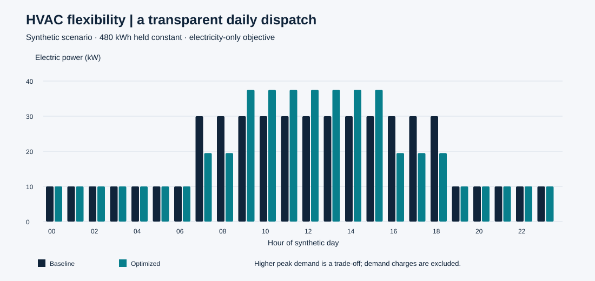

# Electricity Price-Based HVAC Optimization

**Energy analytics · optimization · technology-based business decisions**

Can a building shift a flexible part of its HVAC electricity demand toward cheaper hours while keeping daily energy constant? This reproducible case study compares a fixed schedule with a price-aware linear optimization model, then makes the operational trade-offs visible.



## Why this project

This portfolio demonstration connects my Electrical Engineering background with Python, energy optimization and MSc studies in Technology-Based Business Development. It develops the electricity-price flexibility concept as a self-contained synthetic example. It does not reproduce university or employer files or claim a real building deployment.

## Review in three minutes

1. See the [generated business findings](results/insights.md) and [cost comparison](results/comparison.csv).
2. Compare the [hourly schedule](results/schedule.csv) and [flexibility sensitivity](results/sensitivity.csv).
3. Inspect the [model assumptions and equations](docs/methodology.md), [implementation](src/model.py) and [SQL summary](sql/cost_summary.sql).

## Reproduce

Python 3.10+; tested with Python 3.12. From this folder:

```bash
python -m venv .venv
# Windows: .venv\Scripts\activate
# macOS/Linux: source .venv/bin/activate
python -m pip install -r requirements.txt
python run.py --solver pyomo
python -m unittest discover -s tests -v
```

The no-install fallback is `python run.py --solver greedy`. It solves this same continuous linear model exactly by filling the cheapest permitted hours first. `python run.py` selects Pyomo/HiGHS when both are installed; otherwise it uses the fallback. Tests compare their objective values; schedules can differ when prices tie. The fallback is specific to this model and cannot solve a future general MILP.

## Data and outputs

All inputs are generated, including electricity prices. The 24 hourly records describe one illustrative day, with 480 kWh total baseline demand and a 35% flexible share during 07:00–18:59. Currency is EUR, power is kW, energy is kWh, interval length is one hour. There is no external data dependency. [Data dictionary](docs/data-dictionary.md).

```text
data/raw/    synthetic hourly scenario
src/         model, exact fallback and solver interface
sql/         independently aggregated cost and energy checks
results/     baseline/optimized schedule, comparison and sensitivity CSVs
images/      generated figure
docs/        model, dataset and dashboard guidance
tests/       energy, bounds, objective and edge-case checks
```

## Decision and limitations

The opportunity is price shifting, not reduced energy consumption. This model may increase peak power and does not establish thermal comfort. It excludes demand charges, temperature dynamics, rebound, start-up constraints, losses and forecast error. A practical pilot would need measured thermal responses, facilities approval and a tariff-aware controller. These outputs are synthetic scenario results, not realized financial impact.

[Dashboard specification](docs/dashboard-spec.md) explains how to rebuild the visuals in Power BI; no `.pbix` is claimed. The model is an LP, not a MILP, because it contains no binary operating decisions.

## References and license

Modeling tools: [Pyomo documentation](https://pyomo.readthedocs.io/en/stable/) and [HiGHS](https://highs.dev/). These references describe tools, not the source of the generated inputs. Code, documentation and generated data are available under the [MIT License](LICENSE).

[Back to Monish's portfolio](https://github.com/Monish-1010)
